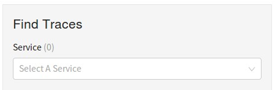
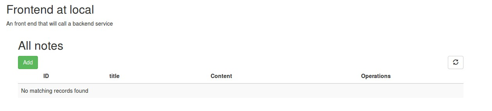
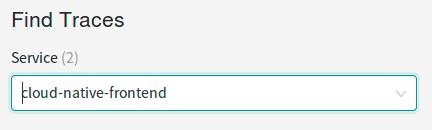
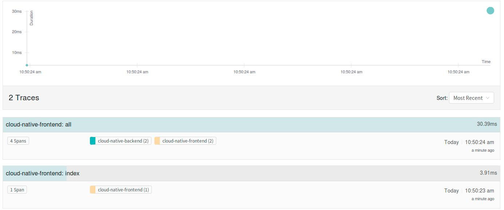
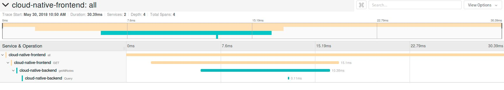

=== Blog publication

=== Spring Boot + OpenTracing
28th of May 2018 by geoand

**Tags** : Spring Boot, OpenTracing, Distributed Tracing

**Description** : Getting started with Spring Boot applications instrumented with OpenTracing in order to get tracing insights with minimal developer effort.

==== Introduction

In a microservice topology, where an incoming HTTP call could end up calling a host of other services, getting insights on the interactions of the individual services and performing debugging becomes complicated.

Distributed tracing gives developers and operators the ability to gain insights on the potentially complex interactions between microservices by painting a picture of what they look like in a graph form.

In it's most basic form, distributed tracing is implemented by having each microservice send special metadata to a collector (like link:https://www.jaegertracing.io[Jaeger] or link:https://zipkin.io/[Zipkin]).
The metadata usually consists of information (start time, end time, component) about the requests and operations performed when handling a external request.
For the collector to be able to construct a graph from the services / operations involved in handling a request, the calls that correspond to the handling of a single HTTP request need to have a piece of information that is unique to them.
Such uniqueness is accomplished by having the first microservice that handles the request create a request id and all subsequent microservices preserve that id in the metadata they send to the collector.

==== General Distributed Tracing prerequisites

The microservices deployed to the container platform need to be properly instrumented.

At the very least, instrumentation consists of propagating the proper HTTP headers when making requests between microservices. There are two options here:

* Manual instrumentation where the developer of each service needs to take care to propagate the HTTP headers to all downstream calls

* Use a library to automatically perform the instrumentation

The reason each application in needs to be instrumented for Distributed Tracing, is that in order to properly determine the relation between services (which service called which - or more formally what the nodes of the call DAG are), special metadata needs to propagated through each HTTP call, from the beginning of the life cycle of an incoming to request to the moment that the request is served to the external client.

Another consideration worth noting, is how the collected metadata reaches the collector. There are a couple of options here:

* Each instrumented microservice communicates with the collector directly

* Instrumented microservices only communicate with a designated agent (which could be a sidecar in container platforms that support them like Kubernetes and Openshift). The agent is
then responsible for the communication with the actual collector

===== Manual vs Automatic instrumentation

Manual instrumentation has the advantage that no extra dependencies need to be packaged with the code in order to get proper instrumentation to work. However it places the burden passing the necessary HTTP headers squarely on the developers shoulders. This can potentially make the code that performs service to service HTTP calls look ugly while more importantly incurring a high probability of such manual instrumentation being forgotten when a developer implements it, or tracing-specific bugs being introduced.

Automatic instrumentation means that the developer need not worry about passing the necessary tracing HTTP headers in every service call, since the library that performs the instrumentation takes care of such operations. It does mean however that an extra library needs to be packaged with the application to have tracing working properly.

==== OpenTracing

link:http://opentracing.io[OpenTracing] makes it easy for developers to add (or switch) tracing implementations with a trivial configuration change.
OpenTracing also offers a lingua franca for OSS instrumentation and platform-specific tracing helper libraries.

In the context of this blog post, OpenTracing provides the automatic instrumentation necessary for the Spring Boot applications we will showcase.

The main advantage of using OpenTracing over other libraries, is that OpenTracing is not tied to any specific collector, thus allowing developers to
choose between various options like Jaeger or Zipkin.

==== Getting started

===== Start Jaeger

The first thing that needs to be done is to stand up a tracing collector locally. In this guide we will be using Jaeger which can be started very easily in dev mode using the following command (make sure you have docker installed)

[source,bash]
----
docker run -d -e \
  COLLECTOR_ZIPKIN_HTTP_PORT=9411 \
  -p 5775:5775/udp \
  -p 6831:6831/udp \
  -p 6832:6832/udp \
  -p 5778:5778 \
  -p 16686:16686 \
  -p 14268:14268 \
  -p 9411:9411 \
  jaegertracing/all-in-one:latest
----

Of the ports mentioned in the previous command, two are of particular interest, port `6831` which will be used to collect the traces from our microservices and port `16686` which is where we can view Jaeger's UI.
By navigating to link:http://localhost:16686[] you'll see that there are no traces yet available, as is depicted in the following image.

===== Run the sample applications

We will be using two sample applications, a link:https://github.com/snowdrop/cloud-native-frontend[frontend] application and a
link:https://github.com/snowdrop/cloud-native-backend[backend] application.
Both application are simple Spring Boot web applications that utilize the OpenTracing's Jaeger link:https://github.com/opentracing-contrib/java-spring-cloud/tree/release-0.1.13/opentracing-spring-cloud-starter-jaeger[autoconfiguration].
by having a Maven dependency in their `pom.xml`

[source,xml]
----
<dependency>
    <groupId>io.opentracing.contrib</groupId>
    <artifactId>opentracing-spring-cloud-starter-jaeger</artifactId>
    <version>0.1.13</version>
</dependency>
----

Simply adding the dependency enables the complete instrumentation of the applications to collect traces and send them to Jaeger (using UDP port `6831` of `localhost`)

Run the backend application using:

[source,bash]
----
mvn clean spring-boot:run -Dspring.profiles.active=local -Ph2
----

and the frontend using:

[source,bash]
----
mvn clean spring-boot:run
----

Open link:http://localhost:8090[] and you'll see an image like the following:

Behind the scenes the frontend application made a call to the backend application.
Such a fact is easily verified by looking at the Jaeger UI and observing that two services have been added, `clound-native-frontend` and `cloud-native-backed`

If we click `Find Traces` in the UI then a couple traces will appear:

One of the traces involves the frontend service only and is produced because the browser is accessing the `index` page of the frontend service.
The second trace is produced when the browser calls the `all` endpoint of the frontend service. That service in turn calls the backend service.
A very clear picture of this interation can be seen in the following image.

==== Extra information

In this section we will go over some of the details of what happened.

By including the opentracing Jaeger dependency in both applications, we ensure that all incoming and outgoing HTTP calls to and from these applications
are properly instrumented. That means that the correct metadata is created and propagated for every HTTP call and that all the metadata ends up in our collector (Jaeger).

Furthermore by accepting the default link:https://github.com/opentracing-contrib/java-spring-cloud/tree/release-0.1.13/opentracing-spring-cloud-starter-jaeger#configuration-options[configuration], we ensure that all metadata collected
is sent to Jaeger at `localhost:6831`.

In case you were wondering where the names `clound-native-frontend` and `cloud-native-backed` that show up in the Jaeger UI came from, we simply
specified then in each application using the `spring.application.name` property.

==== Conclusion

In this blog post we saw how powerful the Spring Boot + Opentracing combination really is. It allowed us to enable Distributed Tracing features in our Spring Boot application
will almost zero effort.

'''

28th of May 2018 by Developer

**Tags** : Spring Boot, Cloud Native Development

**Description** : Lorum ipsum dolor ipset this site is real and it continues to grow.
Lorum ipsum dolor ipset this site is real and it continues to grow.

Lorum ipsum dolor ipset this site is real and it continues to grow.

Formating info is available https://asciidoctor.org/docs/asciidoc-syntax-quick-reference/#horizontal-rules-and-page-breaks[here]

'''

=== New site is live!
/Snowdrop Developer - 2018-05-22/

Welcome to Snowdrop! We're glad you're here. Lorum ipsum dolor ipset this site is real and it continues to grow.

I have no idea how this is going to look. Let's try it out!

'''
